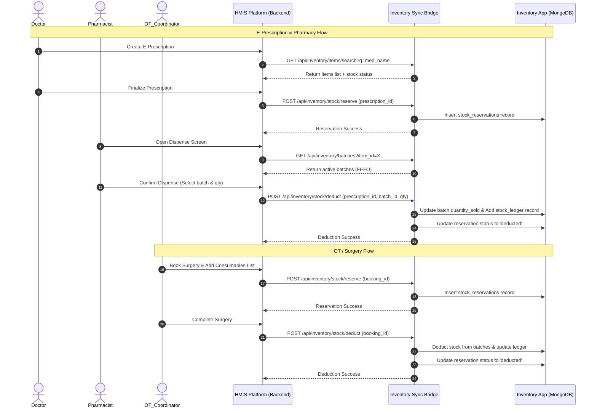

# HMIS & Inventory Sync Platform - Step-by-Step Production Roadmap

This implementation plan details the full schema, routes, frontend views, action flows, and integration logic for all 30 modules, designed to guide step-by-step error-free construction.

---

## 1. Global Specifications & Architecture Rules

### Multi-Tenant Segregation Schema
All database documents across all collections (except global Platform Tenants) must include:
```json
{
  "tenant_id": "string (ObjectId)",
  "hospital_id": "string (ObjectId)",
  "branch_id": "string (ObjectId)",
  "created_by": "string (ObjectId / user_id)",
  "updated_by": "string (ObjectId / user_id)",
  "created_at": "datetime (UTC)",
  "updated_at": "datetime (UTC)",
  "is_deleted": "boolean (default: false)"
}
```
* **Branch-wise MRN Format:** `[BRANCH_PREFIX]-PID-[YYYYMMDD]-[4-DIGIT-SEQUENCE]`
  * Example for Delhi branch: `DEL-PID-20260625-0001`
  * Example for Noida branch: `NOI-PID-20260625-0001`

### Technology Stack Definition
* **Backend:** FastAPI (Python 3.10+), MongoDB (`motor` async driver), Pydantic v2 validation schemas, PyJWT authentication, Redis for token blocklist & background queue triggers.
* **Frontend Web:** React 18 + Vite, Tailwind CSS for styling, TanStack Query v5 for API state cache, React Router v6 for routing, React Hook Form + Zod for validation schemas.
* **Mobile Apps:** React Native with Expo, Expo Router, Expo Notifications.
* **Realtime Communication:** Socket.IO / python-socketio on channels `queue.updated`, `appointment.created`, `patient.checked_in`, `doctor.called_patient`.

### 1.5. Inventory Sync & Deduction Lifecycle

The HMIS platform interacts with the separate Inventory application (deployed at `INVENTORY_API_BASE_URL`) at multiple touchpoints throughout the clinical journey. This integration avoids database duplication; HMIS only tracks status tags and local logs of these requests.

### 1.5.1. Authentication and HTTP Routing to Deployed App

* **Production Environment Target:**
  * HMIS Backend uses environment variable: `INVENTORY_API_BASE_URL=https://inventory.agpkacademy.in`
  * All outbound HTTP requests target the subpath: `https://inventory.agpkacademy.in/api/inventory/...`
* **Secure Bridge Authentication:**
  * To bypass dynamic user session/JWT checks and database lookup overhead for system-to-system requests, we will implement a static API Key handshake.
  * A long-lived, high-entropy token will be defined in both environments:
    * Inventory Backend `.env`: `BRIDGE_API_KEY=your_secure_bridge_token_uuid`
    * HMIS Backend `.env`: `INVENTORY_BRIDGE_API_KEY=your_secure_bridge_token_uuid`
  * The HMIS backend API client (using async `httpx.AsyncClient`) will automatically inject this token into the header of every request:
    ```http
    x-api-key: your_secure_bridge_token_uuid
    ```
  * In the Inventory Backend, we will protect the new `sync_bridge` endpoints using a lightweight FastAPI dependency:
    ```python
    from fastapi import Security, HTTPException, status
    from fastapi.security.api_key import APIKeyHeader
    from config import settings

    api_key_header = APIKeyHeader(name="x-api-key", auto_error=False)

    async def verify_bridge_access(api_key: str = Security(api_key_header)):
        if not api_key or api_key != getattr(settings, "BRIDGE_API_KEY", None):
            raise HTTPException(
                status_code=status.HTTP_401_UNAUTHORIZED,
                detail="Unauthorized: Invalid or missing Bridge API Key"
            )
        return api_key
    ```
    This secures the bridge endpoints and avoids database queries, ensuring high performance.




#### Detailed Lifecycle Workflows:

1. **Patient Prescription Creation (Doctor Console):**
   * **Search:** As the doctor types a medicine name in the E-Prescription builder, the frontend queries `GET /api/inventory/items/search?q=...` via the HMIS backend. This ensures the doctor selects real, existing inventory items.
   * **Verification & Warning:** If stock check shows quantity is `0` or below the minimum alert threshold, the doctor sees a visual indicator (e.g. low-stock badge) but can still prescribe or raise a request.
   * **Stock Reservation (On Prescription Save):** When the doctor finalizes and saves the prescription, the HMIS backend invokes `POST /api/inventory/stock/reserve` with:
     ```json
     {
       "medicine_id": "item_id_from_inventory",
       "quantity": 10,
       "warehouse_id": "branch_warehouse_mapping_id",
       "reference_id": "hmis_prescription_id"
     }
     ```
     The inventory bridge inserts this into `stock_reservations` in the Inventory DB. These reserved items are deducted from the available stock during subsequent check queries to prevent double-selling.

2. **Prescription Dispensing (Pharmacist Dashboard):**
   * **Batch Retrieval:** The pharmacist opens the patient's prescription. The frontend queries `GET /api/inventory/batches?item_id=...` to load all unexpired batches sorted by First Expiry First Out (FEFO).
   * **Stock Deduction:** Once the pharmacist verifies the items and clicks "Dispense", the HMIS backend makes a call to `POST /api/inventory/stock/deduct`:
     ```json
     {
       "medicine_id": "item_id",
       "quantity": 10,
       "warehouse_id": "branch_warehouse_id",
       "reference_id": "hmis_prescription_id",
       "batch_id": "selected_batch_id"
     }
     ```
     The Inventory App updates the database by incrementing `quantity_sold` on the specified batch document, logging a transaction to the `stock_ledger` collection, and flagging the matching reservation as `deducted`.
   * **Alternative Substitution:** If a medicine is out of stock, the pharmacist can request an alternative drug via `POST /api/pharmacy/substitute-request`. If the doctor approves, the original reservation is released, and a new reservation is made for the substituted item.

3. **OT Consumables Workflow (OT Coordinator Desk):**
   * **Check:** The coordinator inputs required surgery kits/materials. The HMIS backend queries `GET /api/inventory/stock/check` for all requested items.
   * **Reservation:** Saving the surgery schedule triggers `POST /api/inventory/stock/reserve` using the `ot_booking_id` as the `reference_id`.
   * **Deduction:** On surgery completion, the coordinator reviews the list of actual materials used and clicks "Finalize Consumables". This makes a bulk request to `POST /api/inventory/stock/deduct` to decrease the inventory of all used batches and clears the reservation.

4. **Cancellation and Release:**
   * If an appointment is cancelled, a prescription is voided, or a surgery is rescheduled/aborted, the HMIS backend automatically sends `POST /api/inventory/stock/release` with the relevant `reference_id`. The Inventory App removes the reservation, returning the blocked stock to the active pool.

### 1.6. Real Hospital UI & Clean Design Guidelines

To match real-world, high-reliability commercial HMIS platforms (like Apollo HMIS, Practo, or Marg ERP), the frontend will adhere to the following visual and operational constraints:

* **Strict Clinical Color Palette:** Only use clean, professional medical colors (Navy Blue `#1e3a8a`, Clinical Slate `#475569`, Hospital Teal `#0d9488`, and soft neutral grays). No futuristic glowing gradients, dark purple/violet "AI" palettes, or high-contrast gaming styles.
* **No AI Visual Elements or Labels:**
  * Absolutely no AI icons (e.g., sparkles, brains, robot avatars).
  * No text indicating "AI-generated," "AI Suggestion," or "Smart Recommendation."
  * The frontend consultation screens must present pure, doctor-controlled structured inputs: auto-completing search grids, standard textareas, and simple tab interfaces.
  * If backend AI summaries are used (e.g., for discharging reports or simplifying patient instruction sheets), they are rendered as standard editable textareas inside the patient's record files, allowing the doctor to review and modify them directly as manual notes, without any AI-branding.
* **Real Hospital Workflow UI Density:**
  * **Compact Grids:** Standard high-density tables displaying patient registries, consultation histories, and ledger receipts. Avoid large whitespace margins or overly spacious designs.
  * **Tabbed EMR Workspaces:** A clean layout with tabs for Vitals, History, Lab Orders, Prescriptions, and Billing, so doctors can easily navigate a patient's complete history on a single screen.
  * **Invoice & Prescription Layouts:** Generate layouts formatted as standard paper prescriptions and GST invoices (with a clear table of Item Description, HSN Code, Base Rate, GST %, Discount %, and final Net Amount).

---

## 2. Phase-by-Phase Roadmap


### Phase 0: Project & Inventory App Analysis (Status: COMPLETE)
* Establish code structural analysis of `inventary`.
* Define inventory sync bridge requirements.

### Phase 1: Foundation & SaaS Architecture
#### Backend
1. **Collections to Create:**
   * `tenants`: `_id`, `name`, `subdomain`, `contact_email`, `status` (`active`/`suspended`), auditing.
   * `branches`: `_id`, `tenant_id`, `name`, `code` (`DEL`, `NOI`), `address`, `contact_number`, `status`, auditing.
   * `users`: `_id`, `tenant_id`, `branch_id`, `name`, `email`, `password_hash`, `role` (referenced from roles), `is_active`, auditing.
   * `roles`: `_id`, `name` (e.g. `Doctor`, `Nurse`), `permissions` (array of strings), auditing.
   * `audit_logs`: `_id`, `tenant_id`, `branch_id`, `user_id`, `action` (`USER_LOGIN`, `PATIENT_CREATE`), `entity`, `entity_id`, `details` (JSON), `ip_address`, `timestamp`.
2. **API Routes:**
   * `POST /api/auth/login`: Accepts `email`, `password`. Returns `access_token`, `refresh_token`, `user` object with role.
   * `POST /api/auth/refresh`: Accepts `refresh_token`. Returns new `access_token`.
   * `POST /api/auth/logout`: Invalidates session in Redis/db.
   * `POST /api/superadmin/tenants`: Create tenant and initialize default tenant settings.
   * `POST /api/superadmin/branches`: Create branch for a tenant.
   * `POST /api/admin/users`: Create/Edit staff user with designated branch and role permissions.
3. **Middleware Guards:**
   * `TenantGuard`: Extracts `X-Tenant-ID` header and verifies matching session access.
   * `BranchGuard`: Extracts `X-Branch-ID` and confirms matching staff permissions.
   * `PermissionGuard`: Verifies JWT payload claims match the routing permission profile.

#### Frontend
1. **Routing System:** React Router with Auth/Role layout guards.
2. **Pages:**
   * `/login`: Credentials form, validation, storage of tokens in HttpOnly cookies/Zustand.
   * `/superadmin/tenants`: Table listing tenants, "New Tenant" form modal, "Toggle Status" trigger.
   * `/admin/branches`: List of branches with edit and toggle-active actions.
   * `/admin/users`: Staff member directory. Search filter, "Add User" drawer with branch selection and role dropdown.

---

### Phase 2: Admin Configuration Module
#### Backend
1. **Collections:**
   * `departments`: `_id`, `name`, `code`, `is_active`, auditing.
   * `pricing_items`: `_id`, `item_type` (`consultation`, `follow_up`, `lab_test`, `ot_charge`, `procedure`), `name`, `code`, `price`, `doctor_id` (optional), auditing.
   * `gst_settings`: `_id`, `item_type`, `gst_rate` (float, e.g. 18.0), `hsn_code`, auditing.
   * `lab_test_master`: `_id`, `test_name`, `test_code`, `price`, `normal_range` (JSON string or object), `unit`, auditing.
   * `ot_rooms` & `rooms`: `_id`, `room_number`, `room_type`, `hourly_rate`, `status` (`available`, `occupied`), auditing.
2. **API Routes:**
   * `GET/POST/PUT /api/config/departments`
   * `GET/POST/PUT /api/config/pricing-items` (handles branch-wise & doctor-wise pricing)
   * `GET/POST/PUT /api/config/lab-test-master`
   * `GET/POST/PUT /api/config/ot-rooms`

#### Frontend
1. **Pages:**
   * `/admin/config/departments`: CRUD grid, list of active departments.
   * `/admin/config/pricing`: Grid showing item description, type, custom base price, GST. "Add pricing" modal with dynamic inputs.
   * `/admin/config/lab-master`: View listing all clinical tests. Add/Edit test modal with columns for Test Name, normal ranges, units, and base price.
   * `/admin/config/rooms`: Grid layout showing OT and ward room allocations and hourly pricing.

---

### Phase 3: Patient Registration & ABHA Fields
#### Backend
1. **Collections:**
   * `patients`: `_id`, `mrn` (`DEL-PID-...`), `first_name`, `last_name`, `phone`, `email`, `gender`, `dob`, `blood_group`, `photo_url`, `emergency_contact`, auditing.
   * `patient_abha_profiles`: `_id`, `patient_id`, `abha_number`, `abha_address`, `status`, auditing.
   * `patient_medical_history`: `_id`, `patient_id`, `allergies` (array), `chronic_conditions` (array), `past_surgeries`, auditing.
2. **API Routes:**
   * `POST /api/patients`: Validates duplicate phone/name. Generates sequential `mrn`.
   * `GET /api/patients`: Search by phone, MRN, or name. Supports pagination.
   * `POST /api/patients/{id}/upload-photo`: Accepts file. Validates size < 5MB and image headers, uploads to storage, updates patient doc.

#### Frontend
1. **Pages:**
   * `/reception/patients`: Search input, results table showing Patient Name, Phone, MRN, Gender, Age. "Register Patient" trigger button.
   * `/reception/patients/register`: Form containing fields: First/Last Name, DOB/Age, Gender, Mobile (validation regex), Address, Emergency Contact, Consent Checkbox. Includes an inline "Upload Photo" widget and a section for ABHA fields.
   * `/reception/patients/{id}`: Dashboard presenting patient timeline, clinical records history, active appointments, and contact card.

---

### Phase 4: ABDM Sandbox Integration
#### Backend
1. **Collections:**
   * `abdm_credentials`: Sandbox keys, Client ID, Client Secret per tenant.
   * `abdm_sync_logs`: API calls logged, payload validation results.
2. **API Routes:**
   * `POST /api/abdm/verify-abha`: Send OTP to ABHA number via external ABDM Gateway.
   * `POST /api/abdm/link-abha`: Link verified ABHA ID to internal patient ID.
   * `POST /api/abdm/scan-share`: Process Scan & Share QR code payload to instantly pre-fill registration forms.

#### Frontend
1. **Pages:**
   * `/admin/config/abdm`: Credential configuration forms with sandbox authentication tests.
   * `/reception/patients/register` ABHA Panel: "Link ABHA" trigger modal, "Send OTP" button, OTP verification field.
   * `/reception/scan-share`: Interactive camera QR code scanning widget. Resolves ABHA payload into form fields.

---

### Phase 5: Appointment & Queue System
#### Backend
1. **Collections:**
   * `appointments`: `_id`, `patient_id`, `doctor_id`, `department_id`, `appointment_date`, `start_time`, `end_time`, `status` (`scheduled`, `checked_in`, `waiting`, `in_vitals`, `ready_for_doctor`, `in_consultation`, `completed`, `cancelled`), auditing.
   * `queue_tokens`: `_id`, `appointment_id`, `token_number` (e.g. `OPD-01`), `status`, `assigned_at`, auditing.
2. **API Routes:**
   * `POST /api/appointments`: Books slot. Validates doctor availability via schedules.
   * `POST /api/appointments/{id}/check-in`: Changes status to `checked_in`, assigns token, generates real-time socket events `queue.updated`.
   * `GET /api/queue`: Returns active tokens sorted by status and queue priority.

#### Frontend
1. **Pages:**
   * `/appointments/calendar`: Monthly calendar view. Clicking a slot opens a sidebar booking form.
   * `/appointments/list`: Filterable list showing date ranges, doctors, and patient statuses. Action buttons: "Check In", "Cancel".
   * `/queue/board`: Real-time public TV dashboard screen. Automatically updates when patients progress.

---

### Phase 6: Nurse Vitals Module
#### Backend
1. **Collections:**
   * `vitals`: `_id`, `visit_id`, `patient_id`, `bp_sys` (int), `bp_dia` (int), `pulse` (int), `temperature` (float), `spo2` (int), `height` (float), `weight` (float), `bmi` (float, auto-calculated), `pain_score` (1-10), `triage_level` (`red`, `yellow`, `green`), auditing.
2. **API Routes:**
   * `POST /api/vitals`: Validates and saves patient vitals. Automatically advances queue token status to `ready_for_doctor`.

#### Frontend
1. **Pages:**
   * `/nurse/dashboard`: List of checked-in patients waiting for vitals.
   * `/nurse/vitals/enter/{id}`: Form showing fields for BP, pulse, temp, SpO2, height, weight. Auto-calculates BMI on keyup. Triage classification slider. "Mark Ready for Doctor" action button.

---

### Phase 7: Doctor EMR / Consultation
#### Backend
1. **Collections:**
   * `visits`: `_id`, `patient_id`, `doctor_id`, `visit_date`, `symptoms`, `clinical_notes`, `diagnosis` (ICD-10 list), `status`, auditing.
2. **API Routes:**
   * `POST /api/consultation/visit/start`: Changes token status to `in_consultation`.
   * `POST /api/consultation/visit/save`: Progress update. Saves active EMR records.
   * `POST /api/consultation/visit/complete`: Finalizes visit record, generates billing ledger charges.

#### Frontend
1. **Pages:**
   * `/doctor/dashboard`: Queue directory list showing "Ready" patients. Click "Call Patient" to trigger socket call notifications.
   * `/doctor/consultation/{visit_id}`: Consultation console. Left column: Patient medical timeline & vital logs. Right column: Editor cards for Clinical Notes, Diagnoses Search (ICD-10 autocomplete), Treatment Plan, Follow-up date picker, and "Finalize & Complete" action button.

---

### Phase 8: Manual Lab Module
#### Backend
1. **Collections:**
   * `lab_orders`: `_id`, `patient_id`, `visit_id`, `test_ids` (array), `status` (`ordered`, `sample_collected`, `result_entered`, `verified`), auditing.
   * `lab_results`: `_id`, `lab_order_id`, `test_id`, `result_value`, `normal_range`, `abnormal_flag` (boolean), `pdf_url`, auditing.
2. **API Routes:**
   * `POST /api/labs/orders`: Generated by doctor. Creates billing items.
   * `POST /api/labs/enter-results`: Accepts array of result readings. Checks against test thresholds to auto-flag abnormal values.
   * `POST /api/labs/upload-report`: Uploads final PDF file to S3 and attaches to lab result document.

#### Frontend
1. **Pages:**
   * `/doctor/consultation/{id}` Lab Section: Search tests, select, add to checkout order list.
   * `/lab/dashboard`: List of pending samples and tests.
   * `/lab/results/enter/{order_id}`: Grid listing ordered tests. Text input fields for values, normal range info, units. "Upload PDF Document" dropzone. "Verify and Publish" button.

---

### Phase 9: E-Prescription & Pharmacy Workflow
#### Backend
1. **Collections:**
   * `prescriptions`: `_id`, `patient_id`, `doctor_id`, `visit_id`, `items` (array of `PrescriptionItem`), `status`, auditing.
   * `PrescriptionItem`: `medicine_id`, `medicine_name`, `dosage`, `frequency`, `duration`, `instructions` (e.g. "before food").
2. **API Routes:**
   * `POST /api/pharmacy/prescriptions`: Saves prescription details.
   * `POST /api/pharmacy/dispense`: Records dispense details and triggers Inventory sync deduction.

#### Frontend
1. **Pages:**
   * `/doctor/consultation/{id}` Prescription Builder: Medicine search input (pulls from Inventory items), dosage inputs (e.g. "1-0-1"), instruction select dropdowns.
   * `/pharmacy/dashboard`: Pharmacy dispense queue. Shows active e-prescriptions.
   * `/pharmacy/dispense/{id}`: Detailed prescription view. Cross-checks stock levels in the Inventory app. Allows partial dispense adjustments, marks substitution requests if stock is unavailable.

---

### Phase 10: Inventory Sync Bridge
#### Backend (Inventory App - `inventary/backend/api/sync_bridge.py`)
1. Create API endpoint logic linked with `x-api-key` validation wrapper.
2. Implement MongoDB logic for `stock_reservations` to isolate blocked stocks.

#### Backend (HMIS Platform)
1. Build `inventory_bridge_service.py` using `httpx` to handle requests to `INVENTORY_API_BASE_URL`.
2. Implement local fallback logging and retry logic for deduction requests when the Inventory app is temporarily offline.

---

### Phase 11: Hospital Finance & GST Billing
#### Backend
1. **Collections:**
   * `invoices`: `_id`, `invoice_number` (`BRANCH-INV-YYYYMMDD-XXXX`), `patient_id`, `items` (array of description, base price, GST %, discount %, line total), `grand_total`, `payment_status` (`unpaid`, `paid`, `due`), auditing.
   * `payments`: `_id`, `invoice_id`, `payment_method` (`Cash`, `Card`, `UPI`, `PayU`), `amount_paid`, `transaction_reference`, auditing.
2. **API Routes:**
   * `POST /api/billing/invoices`: Compiles registration, consultation, lab, and consumable items into a draft invoice. Calculates line values and aggregate GST.
   * `POST /api/billing/payments`: Adds a cash or online payment receipt transaction, updating invoice pay statuses.

#### Frontend
1. **Pages:**
   * `/billing/dashboard`: Invoice registry list. Quick filters: "Unpaid", "Dues".
   * `/billing/invoice/new`: Interactive billing workspace. Select patient to pre-fill consultation/procedure charges. Grid enables adding custom items, pricing modifiers, and discount details.
   * `/billing/invoice/view/{id}`: Invoice detail sheet. Includes payment record button, receipt download action, and a payment link generator.

---

### Phase 12: PayU Payment Integration
#### Backend
1. **Collections:**
   * `payu_transactions`: `_id`, `invoice_id`, `txnid`, `amount`, `status` (`pending`, `success`, `failed`), `hash_sent`, `hash_received`, auditing.
2. **API Routes:**
   * `POST /api/payu/create-payment`: Generates payment link. Computes SHA-512 checkout hash utilizing merchant keys.
   * `POST /api/payu/webhook`: Secure webhook listener. Validates signature hash and updates invoice statuses upon verification.

#### Frontend
1. **Pages:**
   * Patient web portal checkout displays a "Pay Online via PayU" option.
   * Redirects user to standard PayU hosted screen, returning validation progress overlays upon transaction completion.

---

### Phase 13: OT / Surgery Module
#### Backend
1. **Collections:**
   * `ot_bookings`: `_id`, `patient_id`, `surgery_id`, `surgeon_id`, `anesthetist_id`, `room_id`, `schedule_date`, `status` (`planned`, `pre_op_pending`, `in_surgery`, `completed`), auditing.
   * `ot_checklists`: `_id`, `booking_id`, `items_checked` (JSON boolean mapping), `signed_off_by`, auditing.
2. **API Routes:**
   * `POST /api/ot/bookings`: Registers surgery slot.
   * `PUT /api/ot/bookings/{id}/checklist`: Save pre-op checklist checks.
   * `POST /api/ot/bookings/{id}/consumables`: Accepts list of stock items. Calls the Inventory bridge API to deduct stock.

#### Frontend
1. **Pages:**
   * `/ot/dashboard`: Calendar view showing active surgeries scheduled by room.
   * `/ot/booking/new`: Scheduler form to allocate date, surgeon, anesthetist, and room.
   * `/ot/checklist/{booking_id}`: Surgical safety checklist with toggle items.
   * `/ot/notes/{booking_id}`: Forms for anesthesia details, surgery findings, and post-op plans.

---

### Phase 14: Telemedicine with Jitsi
#### Backend
1. **Collections:**
   * `telemedicine_sessions`: `_id`, `appointment_id`, `room_name`, `status`, auditing.
2. **API Routes:**
   * `POST /api/telemedicine/create-room`: Generates secure call parameters for Jitsi.

#### Frontend
1. **Pages:**
   * `/doctor/teleconsultation/{session_id}`: Interactive interface displaying the live Jitsi frame alongside EMR notes and prescription inputs.
   * `/patient/teleconsultation/{session_id}`: Live stream container styled for telemedicine calls.

---

### Phase 15: Patient Mobile App
* **Tech:** React Native + Expo.
* **Screens:**
  1. **Login Screen:** Phone number entry and OTP confirmation.
  2. **Dashboard:** Active appointments calendar, recent prescriptions, and a "Call Queue Token" progress card.
  3. **Book Appointment:** Multi-step wizard to choose branch, department, doctor, and date/time slot.
  4. **Telehealth Screen:** Jitsi call client.
  5. **Billing Screen:** Lists bills, links to PayU payment portal, downloads PDF receipt.

---

### Phase 16: Doctor Mobile App
* **Tech:** React Native + Expo.
* **Screens:**
  1. **Login Screen:** Staff login credentials.
  2. **Dashboard:** Daily schedule timeline.
  3. **Patient Vitals Card:** Displays recorded metrics (BP, Pulse, Temp, SpO2) for checked-in patients.
  4. **Quick Prescriber:** Quick e-prescription drawer.
  5. **Telehealth Screen:** Interactive Jitsi client.

---

### Phase 17: Notifications
#### Backend
1. **Collections:**
   * `notification_logs`: `_id`, `recipient_id`, `channel` (`WhatsApp`, `Push`), `template_name`, `status` (`pending`, `sent`, `failed`), auditing.
2. **Implementation:** Celery worker listens for events (`APPOINTMENT_CONFIRMED`, `BILL_PAID`), processes templates, and sends messages via external SMS/WhatsApp API gateways or Expo Push notifications.

---

### Phase 18: AI Service Layer
#### Backend
1. **Collections:**
   * `ai_generated_summaries`: `_id`, `patient_id`, `source_type` (`notes`, `history`), `generated_text`, `approved_by_doctor` (boolean), auditing.
2. **API Routes:**
   * `POST /api/ai/visit-summarize`: Summarizes clinical visits.
   * `POST /api/ai/simplify-instructions`: Converts medical instructions into simple, localized languages (e.g. English, Hindi).

---

### Phase 19: Reports & Dashboards
#### Backend
1. **API Routes:**
   * `GET /api/reports/revenue`: Returns revenue data grouped by branch, doctor, and billing category.
   * `GET /api/reports/operational`: Tracks patient visit frequency, average consultation times, and lab turnaround durations.

#### Frontend
1. **Pages:**
   * `/reports/dashboard`: Operations and finance dashboard. Includes date range filters, export buttons, and chart visualizations (line charts for revenue, bar charts for patient visits).

---

### Phase 20: File Storage
#### Backend
1. **API Routes:**
   * `POST /api/storage/upload`: Accepts files, validates MIME types, and uploads to an S3-compatible bucket. Returns the file URL.
   * `GET /api/storage/download/{file_id}`: Generates a secure, temporary signed URL. Logs download actions to the audit trail.

---

### Phase 21: Security & Audit
* **Auth Security:** Implement JWT refresh rotation and access token blocklists using Redis storage.
* **Access Isolation:** Apply database filters to isolate tenant data on all read, write, and list operations.
* **Audit Trail:** Capture detail payloads for sensitive operations, including clinical overrides, pricing edits, and billing updates.

---

### Phase 24: IPD (In-Patient Department) Admission & Bed Management (Status: COMPLETE)
#### Backend
1. **Collections:**
   * `ipd_admissions`: `_id`, `tenant_id`, `branch_id`, `patient_id`, `doctor_id` (admitting physician), `room_id` (ward/bed room reference), `admission_date`, `discharge_date`, `discharge_summary`, `status` (`admitted`, `discharged`), `progress_notes` (array), auditing.
   * `bed_transfers`: `_id`, `tenant_id`, `branch_id`, `admission_id`, `from_room_id`, `to_room_id`, `transfer_date`, `reason`, auditing.
   * `ipd_charges`: `_id`, `tenant_id`, `branch_id`, `admission_id`, `charge_type` (`bed_charge`, `doctor_visit`, `nursing_fee`, `procedure`, `other`), `description`, `amount`, `gst_rate`, `date`, auditing.
2. **API Routes:**
   * `POST /api/ipd/admissions`: Admit patient, sets room status to `occupied`.
   * `POST /api/ipd/admissions/{id}/transfer`: Transfers patient bed room.
   * `POST /api/ipd/admissions/{id}/discharge`: Discharges patient, saves discharge summary, frees room space (`available`).
   * `POST /api/ipd/admissions/{id}/charges`: Posts custom manual ledger charge.
   * `POST /api/ipd/admissions/{id}/notes`: Logs progress clinical rounding notes.

#### Frontend
1. **Pages:**
   * `/ipd/dashboard`: Live registry list of active admissions.
   * `/ipd/admit`: Search patient autocomplete, allocate doctor and bed details.
   * `/ipd/workspace/:id`: High-density clinical workspace (Progress notes logs history, Bed transfers portal, Live billing ledger totals with co-pay integrations).
   * `/ipd/discharge/:id`: Medical post-admission instructions.

---

### Phase 25: TPA & Insurance Claims Module
#### Backend
1. **Collections:**
   * `patient_policies`: `_id`, `patient_id`, `insurance_company`, `policy_number`, `card_number`, `valid_till`, `sum_insured`, auditing.
   * `tpa_providers`: `_id`, `name`, `code`, `is_active`, auditing.
   * `insurance_claims`: `_id`, `invoice_id`, `policy_id`, `tpa_id`, `pre_auth_amount`, `approved_amount`, `co_pay_amount` (patient share), `claim_status` (`draft`, `pre_auth_pending`, `approved`, `settled`, `rejected`), auditing.
2. **API Routes:**
   * `GET/POST/PUT /api/billing/tpa-providers`: Manage TPA providers list.
   * `GET/POST/PUT /api/billing/patient-policies`: Register patient policy records.
   * `POST /api/billing/claims`: Submit pre-authorization requests.
   * `PUT /api/billing/claims/{id}/approve`: Approve claim, logs co-pay split logic.

#### Frontend
1. **Pages:**
   * `/admin/config/tpa`: Manage active TPA providers.
   * `/reception/patients/:id` Policy Tab: Add patient insurance card and policy details.
   * `/billing/claims`: List of claims, pre-auth modals, status tracker.
   * `/billing/invoice/new` TPA section: Split-billing configuration.

---

### Phase 26: Radiology & Diagnostic Imaging Module
#### Backend
1. **Collections:**
   * `radiology_orders`: `_id`, `patient_id`, `visit_id`, `modality` (`XRAY`, `MRI`, `CT`, `US`), `test_name`, `status` (`ordered`, `scheduled`, `performed`, `reported`), auditing.
   * `radiology_results`: `_id`, `order_id`, `findings` (text), `impression` (text), `image_links` (array of S3 file urls), `reported_by` (doctor_id), auditing.
2. **API Routes:**
   * `POST /api/radiology/orders`: Order imaging checks.
   * `POST /api/radiology/enter-results`: Radiologist records findings and uploads report images.

#### Frontend
1. **Pages:**
   * `/doctor/consultation/{id}` Radiology Section: Add modality orders.
   * `/radiology/dashboard`: Active imaging worklist.
   * `/radiology/results/enter/{order_id}`: Enter radiology reports with drag-and-drop file attachments.

---

### Phase 27: Doctor Referral & Commission Module
#### Backend
1. **Collections:**
   * `referring_doctors`: `_id`, `name`, `hospital_name`, `phone`, `specialty`, `commission_rules` (JSON: rule type, percentage per department/service), auditing.
   * `referral_transactions`: `_id`, `invoice_id`, `referring_doctor_id`, `visit_id`, `commission_amount`, `payout_status` (`pending`, `paid`), auditing.
2. **API Routes:**
   * `GET/POST/PUT /api/referrals/doctors`: Manage referring doctor masters.
   * `GET /api/referrals/transactions`: List referral transactions and calculated commissions.
   * `POST /api/referrals/payouts`: Clear commissions ledger, logging payout audits.

#### Frontend
1. **Pages:**
   * `/admin/referrals/doctors`: Register referring doctors.
   * `/reception/patients/register`: Prefill referring doctor selection.
   * `/admin/referrals/ledger`: Financial payout tracking dashboard.

---

### Phase 28: Emergency Registry & Ambulance Dispatch
#### Backend
1. **Collections:**
   * `emergency_admissions`: `_id`, `patient_id`, `triage_score` (1-5), `triage_category` (`red`, `yellow`, `green`), `attending_doctor_id`, `status` (`admitted`, `ipd_transferred`, `discharged`), auditing.
   * `ambulance_bookings`: `_id`, `driver_name`, `vehicle_number`, `pickup_address`, `status` (`dispatched`, `arrived`, `completed`), auditing.
2. **API Routes:**
   * `POST /api/emergency/admissions`: Quick registration.
   * `POST /api/emergency/ambulance/book`: Dispatch vehicle.

#### Frontend
1. **Pages:**
   * `/emergency/dashboard`: Live ER triage status list.
   * `/emergency/admit`: Quick admit form (name, age, vitals, triage colors).
   * `/emergency/ambulance`: Map and dispatcher status log.

---

### Phase 29: Visitor Logs & Dietary Kitchen Service
#### Backend
1. **Collections:**
   * `visitor_passes`: `_id`, `admission_id`, `visitor_name`, `phone`, `pass_type` (`day_pass`, `night_attendant`), `valid_till`, auditing.
   * `patient_diet_prescriptions`: `_id`, `admission_id`, `meal_type` (`breakfast`, `lunch`, `dinner`), `diet_type` (`diabetic`, `liquid`, `low_sodium`, `regular`), `status` (`ordered`, `prepared`, `delivered`), auditing.
2. **API Routes:**
   * `POST /api/ipd/visitor-passes`: Create passes.
   * `GET/POST /api/kitchen/diet-orders`: Kitchen workflow routes.

#### Frontend
1. **Pages:**
   * `/ipd/workspace/:id` Visitor Tab: Print day passes and list active visitors.
   * `/kitchen/dashboard`: Diet dashboard listing prepared meals.

---

### Phase 30: HR Roster & Patient Portal Feedback Surveys
#### Backend
1. **Collections:**
   * `staff_rosters`: `_id`, `user_id`, `branch_id`, `shift_date`, `shift_start`, `shift_end`, auditing.
   * `feedback_surveys`: `_id`, `patient_id`, `visit_id`, `rating` (1-5), `comments`, auditing.
2. **API Routes:**
   * `GET/POST /api/hr/rosters`: Register rosters.
   * `POST /api/portal/feedback`: Log survey response.

#### Frontend
1. **Pages:**
   * `/admin/staff/roster`: Calendar scheduler for doctor/nurse duty shifts.
   * `/portal/feedback/:id`: Public feedback survey.

---

### Phase 31: Deployment
Create file configuration templates:
1. `Dockerfile.backend`: Multi-stage build for FastAPI.
2. `Dockerfile.frontend`: Multi-stage build for building and serving the React web app via Nginx.
3. `docker-compose.yml`: Coordinates services: `hmis-api`, `hmis-web`, `redis`, `mongodb`, `nginx`.
4. `nginx.conf`: Directs reverse-proxy traffic to backend API and frontend web apps.

---

### Phase 32: QA & Final Verification
* Run integration scripts that trace the full patient lifecycle: Registration -> Vitals -> Consultation -> E-Prescription -> Billing -> Payment -> Inventory Sync.
