# Hospital AI Document Management System

## Project Overview

This project is a **single-hospital AI-powered Document Management System**. It helps hospital staff securely upload, organize, search, review, and understand patient documents.

The system is focused on document intelligence, not full hospital operations. It is **not** a complete Hospital Management System. It does not manage appointments, billing workflows, pharmacy stock, admissions workflow, live consultation, or treatment decisions.

Its main purpose is simple:

> Turn uploaded hospital documents into searchable, patient-wise, clinically useful information.

---

## Why This Project Was Made

Hospitals handle many scanned documents every day:

- Prescriptions
- Lab reports
- Radiology reports
- Admission documents
- Discharge summaries
- Bills
- Doctor notes
- Registration or referral documents
- Scanned PDFs and images

Without intelligence, these files become difficult to use. Staff may save them in folders, but doctors still need to open each file manually to understand the patient history.

This project was made to solve that problem by combining secure storage, text extraction, AI processing, patient matching, patient summaries, timelines, search, and role-based access control.

---

## What Makes This Project Special

Most document management systems can upload and store files. This project goes further.

It can:

- Save original files privately.
- Extract text from PDFs and supported images.
- Use Gemini AI to read hospital documents.
- Extract patient details, doctor details, hospital details, diagnosis, medicine, and report information.
- Match documents to the correct patient.
- Generate document-level summaries.
- Generate a broad patient clinical summary from all uploaded documents.
- Update patient summaries automatically after new uploads.
- Build patient timelines.
- Search patients in real time using patient data and clinical summary content.
- Protect APIs using role-based access control.
- Serve documents only through authenticated backend endpoints.

---

## Current Technology Stack

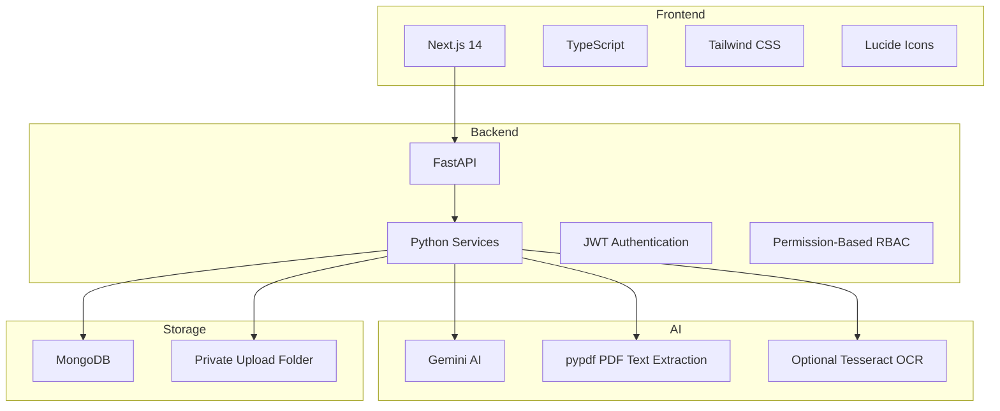

---

## Project Folder Structure

```text
DMS main/
  backend/
    app/
      auth/
      models/
      routes/
      schemas/
      services/
      utils/
    uploads/
    requirements.txt
    Dockerfile

  frontend/
    app/
    components/
    lib/
    package.json
    Dockerfile

  docker-compose.yml
  README.md
  Project.md
```

---

## Main Workflow

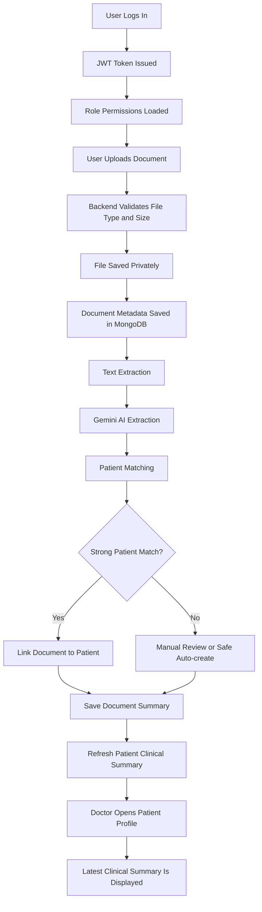

---

## Authentication And RBAC

The project uses JWT authentication and backend-enforced role-based access control.

Frontend hiding is only for user experience. Real security is enforced in the backend.

### Supported Roles

1. Admin
2. Doctor
3. Document Staff
4. Receptionist

### Permission Flow

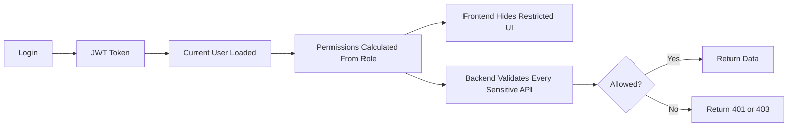

### Current Permission Model

| Role | Main Access |
|---|---|
| Admin | Users, roles, audit logs, all patients, all documents, clinical summaries, downloads, archive |
| Doctor | Patient clinical view, summaries, timeline, clinical documents, downloads |
| Document Staff | Upload, document metadata, extraction status, matching, verification, basic patient data |
| Receptionist | Create/update basic patient details, search patients, upload/basic metadata only |

### Important Security Rules

- Inactive users cannot access APIs.
- Users cannot change their own role.
- Documents are not exposed through public file paths.
- Download/preview goes through authenticated backend endpoints.
- Clinical summary is restricted to roles with `summary.view_clinical`.
- Verification controls are restricted to roles with `documents.verify`.

---

## Document Upload Workflow

The upload page now shows a staged progress experience:

- Uploading
- Saving
- Extracting
- Processing

The browser can measure real upload percentage. Saving, extraction, and AI processing are shown as smooth estimated progress until the backend response completes.

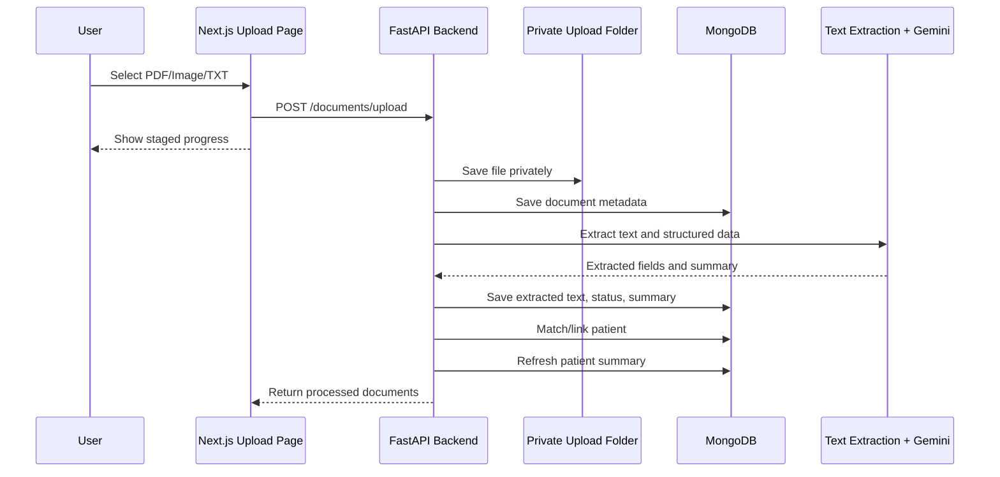

### Upload Validation

The backend validates:

- File extension
- MIME type
- File size
- Private storage path

Supported upload types include:

- PDF
- JPG/JPEG
- PNG
- TXT

---

## Document Storage

The project stores files and metadata separately.

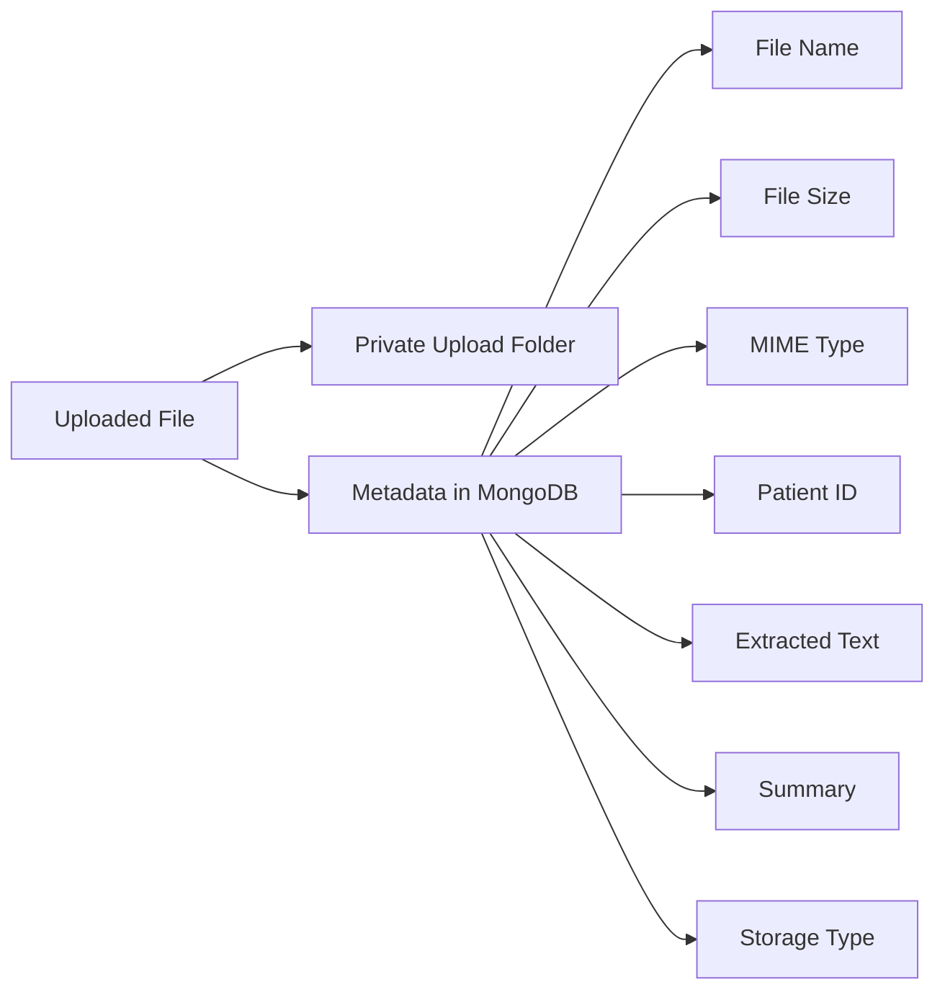

The actual file is stored in `backend/uploads`. MongoDB stores metadata, extracted text, summaries, status fields, and the internal storage path. Raw local paths are not shown in the frontend.

---

## Text Extraction

The system extracts readable text before summary generation.

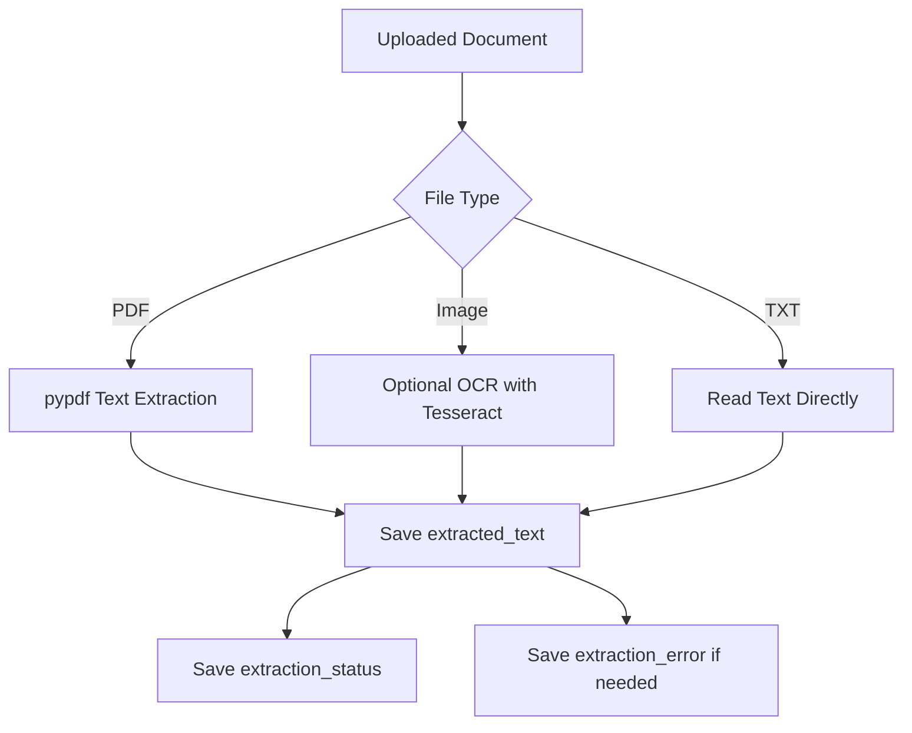

If extraction fails, upload still continues. The database stores `extraction_status` and `extraction_error`.

---

## Gemini AI Processing

Gemini is used to extract structured hospital document information.

It can extract:

- Patient name
- UHID/patient code
- Mobile number
- Age
- Gender
- Document date
- Document type
- Doctor details
- Hospital details
- Diagnosis
- Symptoms
- Medicines
- Lab information
- Procedures
- Follow-up advice
- Summary

If the Gemini API key is missing or AI fails, upload still works with fallback behavior.

---

## Patient Matching

After extraction, the system tries to connect the document to the right patient.

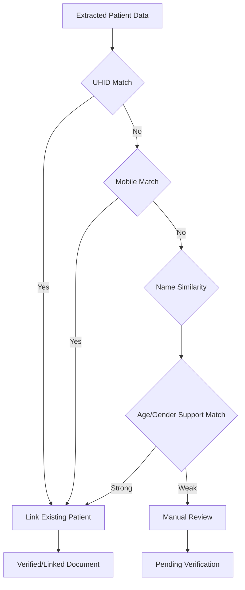

Matching uses:

- UHID/patient ID
- Mobile number
- Patient name similarity
- Age
- Gender

---

## Patient Clinical Summary

The patient profile shows the latest saved patient summary at the top.

There is **no manual Regenerate Summary button**. Summary refresh happens internally when a document is linked or verified.

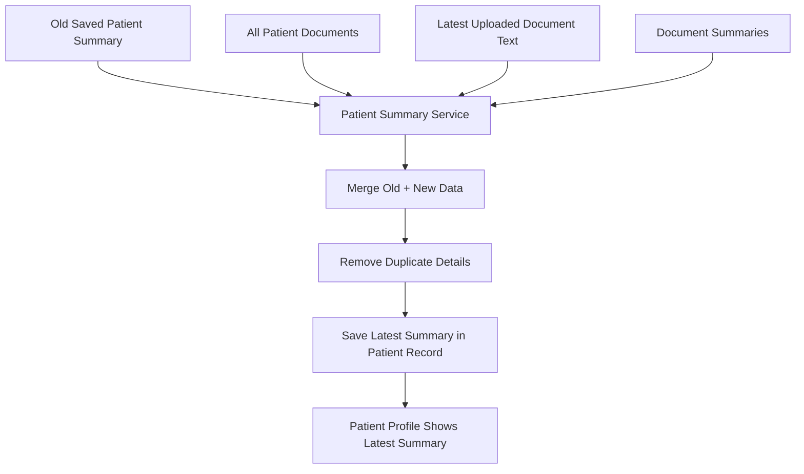

### Saved Summary Fields

The patient summary stores:

- `patient_id`
- `broad_description`
- `structured_summary_json`
- `source_document_ids`
- `total_documents`
- `latest_document_date`
- `last_generated_at`
- `generation_status`
- `generation_error`

### Summary Sections

The summary includes:

- Broad patient description
- Patient overview
- Old disease/past medical history
- Current diagnosis
- Symptoms
- Treatment history
- Current and previous medications
- Hospital/clinic names
- Doctor names
- Medical procedures
- Lab report highlights
- Radiology report highlights
- Admission/discharge details
- Allergies and risk alerts
- Follow-up and pending actions
- Billing/insurance details
- Timeline
- Missing information

### AI Safety Rules

The AI must:

- Use only uploaded documents.
- Not invent medical facts.
- Write "Not mentioned in uploaded documents." when information is missing.
- Write "Needs doctor verification." when information is unclear.
- Avoid final medical advice.
- Avoid marking a medication as current unless the latest document clearly supports it.

---

## What "Needs Doctor Verification" Means

This label means the system found possible medical information but cannot confidently confirm it.

It may appear when:

- OCR text is unclear.
- The scan is blurred or cropped.
- Handwriting is difficult.
- AI finds a possible diagnosis/medicine but the context is uncertain.
- A lab/radiology result looks important but needs professional review.

This is a safety feature. It tells the doctor to check the original document before relying on that detail.

---

## Timeline

The project stores patient timeline entries when documents are linked.

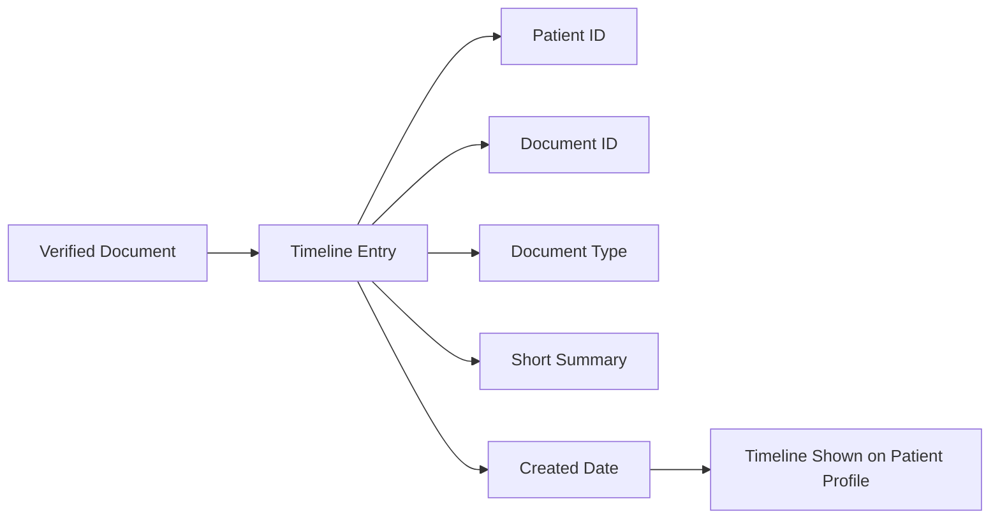

---

## Real-Time Patient Search

Patient search works while typing with a 300ms debounce.

It searches:

- Patient name
- Patient ID/UHID
- Mobile number
- Age
- Gender
- Address
- Email
- Blood group
- Broad summary
- Diagnosis/history/treatment
- Medicines
- Doctor names
- Hospital names
- Procedures
- Lab/radiology highlights
- Timeline events

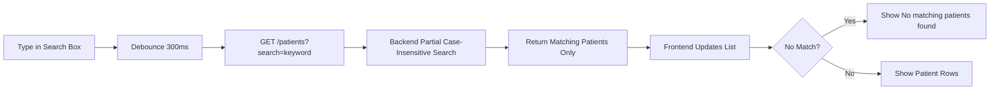

---

## Secure Document View And Download

Documents are served only through authenticated backend routes.

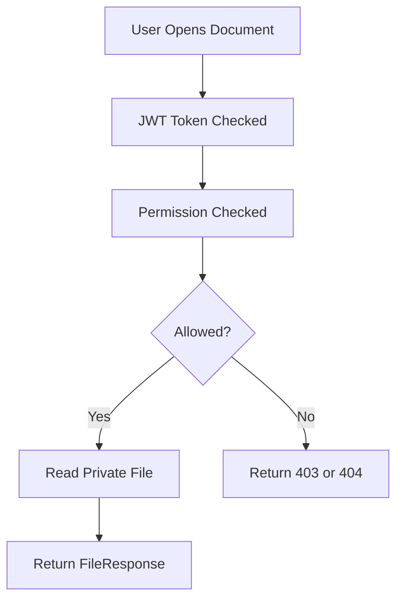

The frontend never receives raw local upload paths.

---

## Audit Logs

Audit logging exists for important actions such as:

- Login
- Admin seed creation
- User creation/update/disable
- Document upload
- Document view
- Document download
- Document verification
- Document rejection
- Document archive/soft delete
- Patient summary view
- Denied document access attempts

Audit logs are visible only to users with audit permission, normally Admin.

---

## Timezone Handling

Backend timestamps are stored in UTC, which is the recommended database practice.

The backend serializer returns timezone-aware timestamps like:

```text
2026-06-15T07:34:00+00:00
```

The browser converts this to the user's local timezone. For India, UTC + 5:30 displays correctly as IST.

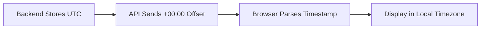

---

## Database Overview

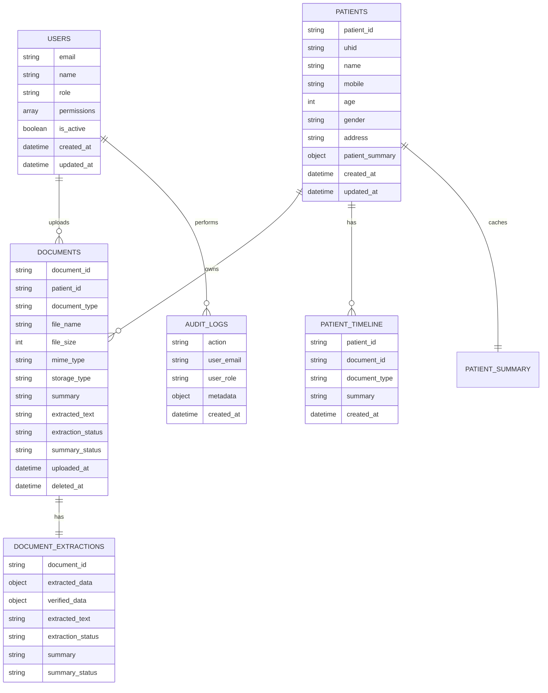

---

## API Groups

### Auth

- `POST /auth/login`
- `POST /auth/register-admin-seed`
- `GET /auth/me`

### Users

- `GET /users`
- `POST /users`
- `PUT /users/{user_id}`
- `DELETE /users/{user_id}`

### Patients

- `GET /patients`
- `POST /patients`
- `GET /patients/{patient_id}`
- `PUT /patients/{patient_id}`
- `GET /patients/{patient_id}/summary`
- `GET /patients/{patient_id}/documents`
- `GET /patients/{patient_id}/timeline`

### Documents

- `POST /documents/upload`
- `GET /documents`
- `GET /documents/{document_id}`
- `GET /documents/{document_id}/file`
- `GET /documents/{document_id}/download`
- `POST /documents/{document_id}/process-gemini`
- `PUT /documents/{document_id}/verify`
- `PUT /documents/{document_id}/reject`
- `DELETE /documents/{document_id}`

### Search, Dashboard, Audit

- `GET /search/patients`
- `GET /search/documents`
- `GET /dashboard/stats`
- `GET /audit-logs`

---

## Benefits

### For Doctors

- Quickly understand patient history.
- See old diseases, diagnosis, medications, lab/radiology findings, procedures, and timeline.
- Open original documents only when needed.

### For Document Staff

- Upload documents with visible progress.
- See extraction, matching, and summary status.
- Verify patient links and document type.

### For Receptionists

- Create and update basic patient information.
- Search patients quickly.
- Upload basic documents when permitted.

### For Admins

- Manage users and roles.
- View audit logs.
- Access system-wide dashboard and documents.

---

## Trust Level

You can trust this project for:

- Secure document storage.
- Patient-wise organization.
- Searchable document metadata.
- Helpful AI summaries.
- Audit trails.
- Role-based access enforcement.

You should not use it as:

- A replacement for doctors.
- A final medical diagnosis tool.
- A medication decision tool.
- Emergency medical advice.

The system is a **clinical document intelligence assistant**. Final medical judgment belongs to qualified medical professionals.

---

## Current Limitations

- OCR quality depends on scan quality.
- Tesseract must be installed for image OCR.
- AI extraction depends on document clarity.
- Doctor-patient assignment is not yet modeled separately, so doctor access follows current role-level visibility.
- This is not a full HMS.

---

## Future Improvements

Possible future enhancements:

- Doctor-patient assignment rules.
- Cloud object storage.
- Versioned patient summary history.
- Duplicate document detection.
- Better OCR for handwriting.
- Export patient summary as PDF.
- FHIR/HL7 integration.
- Similar old case discovery.
- More detailed document type taxonomy.

---

## Final Summary

This project securely stores hospital documents and turns them into patient-wise searchable intelligence.

It combines:

1. JWT authentication
2. Role-based permissions
3. Private document storage
4. Text extraction
5. Gemini AI extraction
6. Patient matching
7. Document summaries
8. Automatic patient clinical summaries
9. Patient timelines
10. Real-time patient search
11. Secure document preview/download
12. Audit logging

That makes it much more useful than a simple file storage system while still keeping the doctor in control of final clinical decisions.

